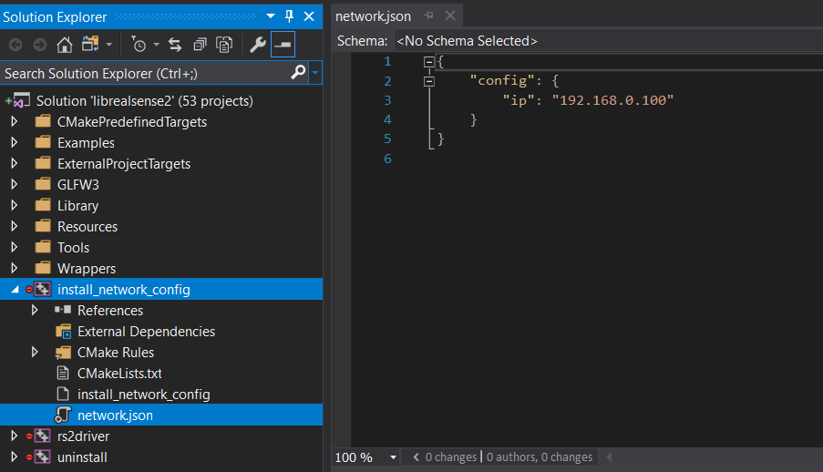

# LIPSedge™ AE400 stereo camera
[LIPSedge™ AE400](https://www.lips-hci.com/product?product_id=29) stereo camera is powered by Intel® RealSense™ Technology and designed for industrial applications, such as robot applications, logistic/factory automation, and 3D monitoring/inspection.

## Overview
This software development kits is fully compatible to [Intel® RealSense™ SDK 2.0](https://github.com/IntelRealSense/librealsense) to help you connect to LIPSedge AE400 camera easily, the RealSense SDK already offers many tools, code samples, and wrappers for integration with existing 3rd-party technologies and software languages.

## Build from source
You need CMake to build this SDK, the step is almost same as RealSense project, please refer their wiki pages for more instructions.
 - [Installation on Ubuntu Linux](https://github.com/IntelRealSense/librealsense/blob/master/doc/installation.md)
 - [Installation on Windows](https://github.com/IntelRealSense/librealsense/blob/master/doc/installation_windows.md)


The simple command to build Release SDK is
 ```
 $ mkdir build_Release
 $ cd build_Release
 $ cmake .. -DCMAKE_BUILD_TYPE=Release
 $ make -j4
 $ sudo make install
 ```

## Build wrappers for your applications
Intel RealSense SDK already supports many 3rd-party technologies, you can check the [build configurations](https://github.com/IntelRealSense/librealsense/wiki/Build-Configuration) to enable the wrapper you want and re-run CMake build to get binary library.

### wrappers provided by Intel RealSense SDK
 - [Wrapper Overview (support list)](https://github.com/IntelRealSense/librealsense/tree/master/wrappers)
 - [OpenCV](https://github.com/IntelRealSense/librealsense/tree/master/wrappers/opencv)
 - [OpenNI2](https://github.com/IntelRealSense/librealsense/tree/master/wrappers/openni2)
 - [Python](https://github.com/IntelRealSense/librealsense/tree/master/wrappers/python)

 ### wrappers provided by LIPS
 - [NVIDIA Isaac SDK](https://developer.nvidia.com/isaac-sdk) - Please checkout our LIPS project [stereo_ae400](https://github.com/lips-hci/stereo_ae400) on GitHub.

The simple command to build Release SDK with OpenNI2/OpenCV/Python wrappers is
```
$ export OpenCV_DIR=/usr/local/share/OpenCV
$ cmake .. \
  -DCMAKE_BUILD_TYPE=Release \
  -DBUILD_OPENNI2_BINDINGS=true \
  -DOPENNI2_DIR=/usr/include/openni2 \
  -DBUILD_PYTHON_BINDINGS=true \
  -DPYTHON_EXECUTABLE=/usr/bin/python3 \
  -DBUILD_PYTHON_DOCS=true \
  -DBUILD_CV_EXAMPLES=true
$ make -j4
$ sudo make install
```

## Patch your RealSense git repository
LIPS provides a helper script to support you applying file changes on a clean RealSense git repository to get a LIPS AE400 SDK codebase.

* Follow below steps to patch your local RealSense git repository, e.g. version is 2.29.0.
```
$ git clone https://github.com/IntelRealSense/librealsense.git ~/rs2
$ cd ~/rs2
$ git checkout -b rs2.29.0 v2.29.0
```
Assume you have cloned [AE400 SDK](https://github.com/lips-hci/ae400-realsense-sdk), switch to it and run the script.
You have to input path of your RealSense source directory as input argument.
```
$ cd ae400-realsense-sdk
ae400-realsense-sdk$ ./scripts/patch-realsense-to-lips-ae400-sdk.sh ~/rs2
```
After successfully patching, you can build AE400 SDK from this source.

### Installation on Linux system
Assume you have completed CMake build on AE400 SDK and output directory is 'build_Release'
* Edit network setting by your preferred text editor
```
rs2$ cd build_Release
rs2/build_Release$ vim config/network.json
```
The default IP address is 192.168.0.100. You need to modify it according to your network environment.
```
{
    "config": {
        "ip": "192.168.0.100"
    }
}
```
* After saving file network.json, you can run install command, default install prefix is '/usr/local'.
```
rs2/build_Release$ sudo make install
```
#### Run capture example
```
rs2/build_Release$ cd examples/capture
rs2/build_Release/examples/capture$ ./rs-capture
network setting is found at /usr/etc/LIPS/lib/network.json

```


### Installation on Windows system
Assume you have ran the script to patch your RealSense repository and also completed CMake configuration and generation to get Visual Studio 2015/2017 project solution(.sln) on Windows. Open librealsense2.sln, find project 'install_network_config' and edit the source 'network.json'



Re-build the solution 'librealsense2', the updated network.json is copied to your runtime output directory, e.g. 'Release' or 'Debug' together with your binary executables, e.g. realsense-viewer.exe or rs-capture.exe.

#### Run capture example
Double click the example 'rs-capture.exe' to run it! Make sure you have correct IP address setting in network.json in the same directory.

**TIPS**: You can launch Command Prompt (cmd.exe) and use command 'ping' to check network connection between your host and AE400 camera, this is useful debug technique to make sure network connection is OK.
```
C:\>ping <your AE400 IP address>

Pinging 192.168.0.100 with 32 bytes of data:
Reply from 192.168.0.100: bytes=32 time<1ms TTL=64
Reply from 192.168.0.100: bytes=32 time<1ms TTL=64
Reply from 192.168.0.100: bytes=32 time<1ms TTL=64
Reply from 192.168.0.100: bytes=32 time<1ms TTL=64

Ping statistics for 192.168.0.100:
   Packets: Sent = 4, Received = 4, Lost = 0 (0% loss),
...
```

**NOTE**: You might get build errors on Windows/Linux. Please file issues on Github or send your problems to [LIPS](info@lips-hci.com).
