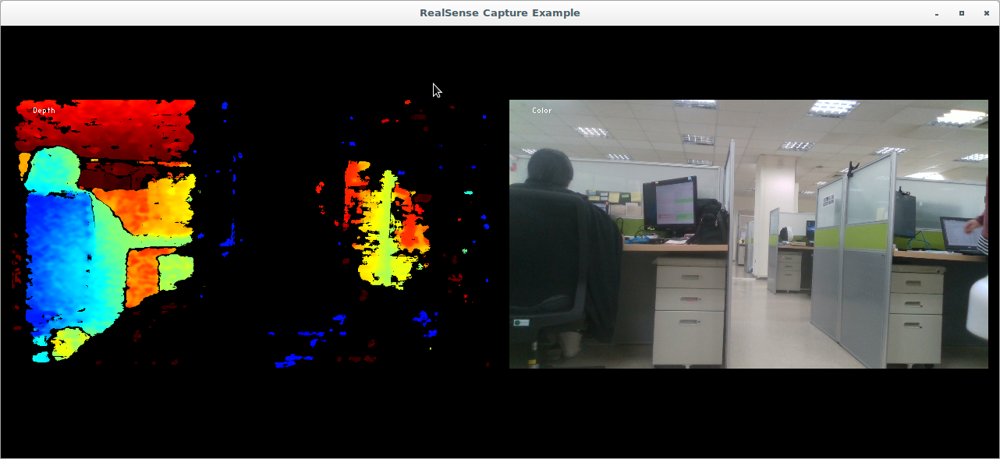

# LIPSedge™ AE400 Industrial 3D Camera

**LIPSedge™ AE400** is an industrial GigE 3D camera with IP67 protection and powered by Intel® RealSense™ technology and designed for industrial applications, such as robot application, logistic/factory automation, and 3D monitoring/inspection.

 - [Product Overview](https://www.lips-hci.com/product?product_id=29)
 - [Product Documents](https://filebox.lips-hci.com/index.php/s/ZNO5JggmYeddYcA)
 - [Product Support](https://www.lips-hci.com/downloads/category)
 - See details on https://www.youtube.com/watch?v=kyjbJSM6CjQ

## SDK Overview
This software development kits(SDK) is fully compatible to [Intel® RealSense™ SDK 2.0](https://github.com/IntelRealSense/librealsense) to assist you connect LIPSedge AE400 3D camera to your application fast and easily. RealSense™ SDK 2.0 already offers many tools, code samples, and wrappers for integration with existing 3rd-party technologies and software languages.

:pushpin: **Minimum requirement of RealSense™ SDK release is [2.17.1](https://github.com/IntelRealSense/librealsense/releases?after=v2.17.1)** ([learn more](doc/support_list_ae400_realsense_sdk.md))

## Build from source
You need CMake to build this SDK, please refer steps described on RealSense™ SDK document.
 - [Installation on Ubuntu Linux](https://github.com/IntelRealSense/librealsense/blob/master/doc/installation.md)
 - [Installation on Windows](https://github.com/IntelRealSense/librealsense/blob/master/doc/installation_windows.md)

The simple command to have Release build is
 ```
 $ mkdir build_Release
 $ cd build_Release
 $ cmake .. -DCMAKE_BUILD_TYPE=Release
 $ make -j4
 $ sudo make install
 ```

## Build wrappers for your applications
Intel RealSense SDK already supports many 3rd-party technologies, you can check the [build configurations](https://github.com/IntelRealSense/librealsense/wiki/Build-Configuration) to enable the wrapper you want and re-run CMake build to get binary library.

### wrappers provided by Intel RealSense™ SDK
 - wrapper overview ([learn more](https://github.com/IntelRealSense/librealsense/tree/master/wrappers))
 - OpenCV ([learn more](https://github.com/IntelRealSense/librealsense/tree/master/wrappers/opencv))
 - OpenNI2 ([learn more](https://github.com/IntelRealSense/librealsense/tree/master/wrappers/openni2))
 - Python 2.7 / 3.6 / 3.7 ([learn more](https://github.com/IntelRealSense/librealsense/tree/master/wrappers/python))
 - ROS ([learn more](https://github.com/IntelRealSense/realsense-ros))

 ### wrappers provided by LIPS
 - [NVIDIA Isaac SDK](https://developer.nvidia.com/isaac-sdk) integration how-to ([learn more](https://github.com/lips-hci/stereo_ae400))

The simple command to build Release SDK with OpenNI2/OpenCV/Python wrappers is
```
$ export OpenCV_DIR=/usr/local/share/OpenCV
$ cmake .. \
  -DCMAKE_BUILD_TYPE=Release \
  -DBUILD_OPENNI2_BINDINGS=true \
  -DOPENNI2_DIR=/usr/include/openni2 \
  -DBUILD_PYTHON_BINDINGS=true \
  -DPYTHON_EXECUTABLE=/usr/bin/python3 \
  -DBUILD_PYTHON_DOCS=true \
  -DBUILD_CV_EXAMPLES=true
$ make -j4
$ sudo make install
```

## Patch your RealSense™ SDK to support AE400
LIPS provides a helper shell script to upgrade a clean RealSense SDK release automatically to support LIPSedge AE400 3D camera.

* Follow below steps to patch your local RealSense SDK git repository, assume you want to use release [v2.29.0](https://github.com/IntelRealSense/librealsense/releases/tag/v2.29.0). First, you have to clone libealsense.git to your host.
```
$ git clone https://github.com/IntelRealSense/librealsense.git /home/<username>/rs2
$ cd ~/rs2
$ git checkout -b rs2.29.0 v2.29.0
Switched to a new branch 'rs2.29.0'

``` 

:hammer: If you use release **2.17.1**, PLEASE merge this fix commit [89b8a02b - Switch to use stable libusb version #3049](https://github.com/IntelRealSense/librealsense/commit/89b8a02b) manually to switch to stable libusb version.
If your release is **2.18** or later versions, you can ignore this step!
```
$ git checkout -b rs2.17.1 v2.17.1
Switched to a new branch 'rs2.17.1'

$ git cherry-pick 89b8a02b
[rs2.17.1 7ad72a880] Switch to use stable libusb version (#3049)
 Author: Sergey Dorodnicov <sergey.dorodnicov@intel.com>
 Date: Sun Jan 13 18:37:53 2019 +0200
 1 file changed, 1 insertion(+), 1 deletion(-)

``` 

Next step you have to clone [AE400 SDK](https://github.com/lips-hci/ae400-realsense-sdk) to your host, switch to it and run the script, you have to input path of your RealSense source directory as input argument.
```
$ cd /home/<username>/
$ git clone https://github.com/lips-hci/ae400-realsense-sdk.git
$ cd ae400-realsense-sdk
$ ./scripts/patch-realsense-to-lips-ae400-sdk.sh ~/rs2
```
After successfully patching, you can build AE400 SDK from this source.

:bulb: For Windows users, we recommend [Git for Windows](https://gitforwindows.org/) which provides a BASH emulation used to run Git from the command line, you can run our script inside Git BASH environment.


### Installation on Ubuntu Linux
Run CMake in the patched git repository, assume output directory is 'build_Release'
* Edit network setting by your preferred text editor
```
rs2$ cd build_Release
rs2/build_Release$ vim config/network.json
```
The default IP address is 192.168.0.100. You need to modify it according to your network environment.
```
{
    "config": {
        "ip": "192.168.0.100"
    }
}
```
* After saving file network.json, you can run install command, default install prefix is '/usr/local'.
```
rs2/build_Release$ sudo make install
```
#### Run capture example
```
rs2/build_Release$ cd examples/capture
rs2/build_Release/examples/capture$ ./rs-capture
network setting is found at /usr/etc/LIPS/lib/network.json

```


### Installation on Windows
Assume you have processed the script to patch your RealSense™ SDK repository and completed CMake configuration and generation to generate the Visual Studio 2015/2017 project solution. Open librealsense2.sln, find project 'install_network_config' and edit the source 'network.json'


Re-build the solution 'librealsense2', the updated network.json is copied to your runtime output directory, e.g. 'Release' or 'Debug' together with your binary executables, e.g. realsense-viewer.exe or rs-capture.exe.

#### Run capture example
Double click the example 'rs-capture.exe' to run it! Make sure you have correct IP address setting in network.json in the same directory.

:bulb: Windows user can launch Command Prompt (cmd.exe) and use command 'ping' to check network connection between your PC host and AE400 camera, this is useful debug technique to make sure network connection is OK.
```
C:\>ping <your AE400 IP address>
```
For example, assume your AE400 camera IP address is 192.168.0.100 
```
C:\>ping 192.168.0.100

Pinging 192.168.0.100 with 32 bytes of data:
Reply from 192.168.0.100: bytes=32 time<1ms TTL=64
Reply from 192.168.0.100: bytes=32 time<1ms TTL=64
Reply from 192.168.0.100: bytes=32 time<1ms TTL=64
Reply from 192.168.0.100: bytes=32 time<1ms TTL=64

Ping statistics for 192.168.0.100:
   Packets: Sent = 4, Received = 4, Lost = 0 (0% loss),
...
```

**NOTE**: You might get build errors or meet problems to run realsense-viewer on Windows/Linux. Any questions are welcome, please file issues on Github or send your problems to [LIPS]((https://www.lips-hci.com/contact)).
:email: info@lips-hci.com
